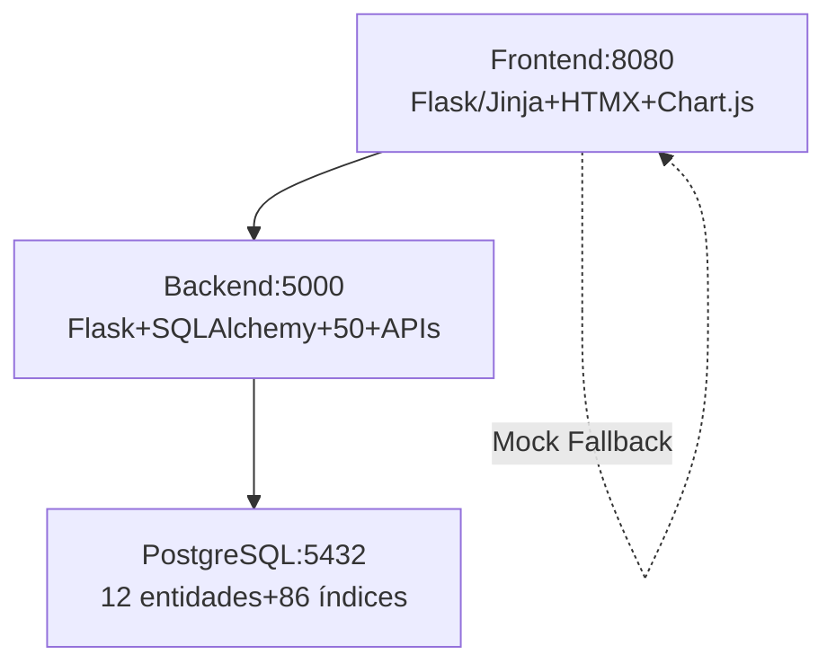

# 🚀 Exitus - Sistema de Gestão de Investimentos

[](https://github.com/elielsonfontanezi/exitus/tree/feature/docs-reestruturacao)
[](https://podman.io/)

**Exitus** é um sistema completo de gestão de portfólio multi-corretora (B3/NASDAQ), com buy signals automáticos, alertas real-time, relatórios performance e dashboards interativos.

## ✨ Funcionalidades Principais

- **10 Dashboards**: Buy Signals, Portfólios, Transações, Proventos, Alertas, Relatórios...
- **Multi-Mercado**: Ações BR/US, FIIs, renda fixa (XP, etc.)
- **Buy Signals**: Score 0-100 (PETR4 80/100), preço teto Graham/Gordon
- **Alertas**: PETR4 >R$35, dividendos previstos (toggle real-time)
- **Relatórios**: PERFORMANCE anual (Sharpe 1.45, drawdown -8.3%)
- **Cotações Live**: Cache 15min, fallback multi-provider

**Demo**: `admin` / `admin123` → `localhost:8080/dashboard`

## 🏗️ Arquitetura Rápida



## 🚀 Getting Started (3min)

```bash
# Clone + env
git clone https://github.com/elielsonfontanezi/exitus.git
cd exitus
cp .env.example .env  # admin123 OK

# Dev up (Podman)
./scripts/rebuild-restart-exitus-backend.sh
./scripts/rebuild-restart-exitus-frontend.sh

# Seeds (admin + dados demo)
podman exec exitus-backend python -c 'from app.seeds import seed_all; seed_all()'

# Acessar
firefox http://localhost:8080  # Login admin/admin123
```

**Verificar**: `podman ps` (3 containers Up) + `/health` OK.

## 📚 Documentação Completa

| Guia | Descrição | Link |
|------|-----------|------|
| **ARCHITECTURE** | Stack, diagramas ERD/fluxos | [docs/ARCHITECTURE.md](docs/ARCHITECTURE.md) |
| **USER GUIDE** | Tour dashboards + cenários | [docs/USER_GUIDE.md](docs/USER_GUIDE.md) |
| **API REFERENCE** | 50+ endpoints + cURL | [docs/API_REFERENCE.md](docs/API_REFERENCE.md) |
| **RUNBOOK** | Podman + troubleshooting | [docs/OPERATIONS_RUNBOOK.md](docs/OPERATIONS_RUNBOOK.md) |
| **CHANGELOG** | Histórico M0-M7.5 | [docs/CHANGELOG_MODULOS.md](docs/CHANGELOG_MODULOS.md) |

**API Completa**: `./scripts/generate_api_docs.sh` → `docs/API_REFERENCE_COMPLETE.md` (67 rotas).

**DB Schema**: `docs/EXITUS_DB_STRUCTURE.txt`.

## 📈 Status Módulos

✅ **M0-M7.5 Production Ready** (v0.7.5)  
🔄 **M8 Analytics** (Monte Carlo, PDF export)  

## 🤝 Contribuição

1. `git checkout -b feature/minha-func`  
2. `./scripts/rebuild-restart-exitus-backend.sh` (testes locais)  
3. Docs em `docs/` | Código em `backend/`/`frontend/`  
4. `git push && gh pr create`

## 📞 Suporte

- **Troubleshooting**: [docs/OPERATIONS_RUNBOOK.md](docs/OPERATIONS_RUNBOOK.md)  
- **Issues**: [GitHub Issues](https://github.com/elielsonfontanezi/exitus/issues)

---
**Desenvolvido por**: Elielson Fontanezi | **AI Assist**: Perplexity  
**Licença**: Proprietária | **Stars** ❤️ bem-vindos!
