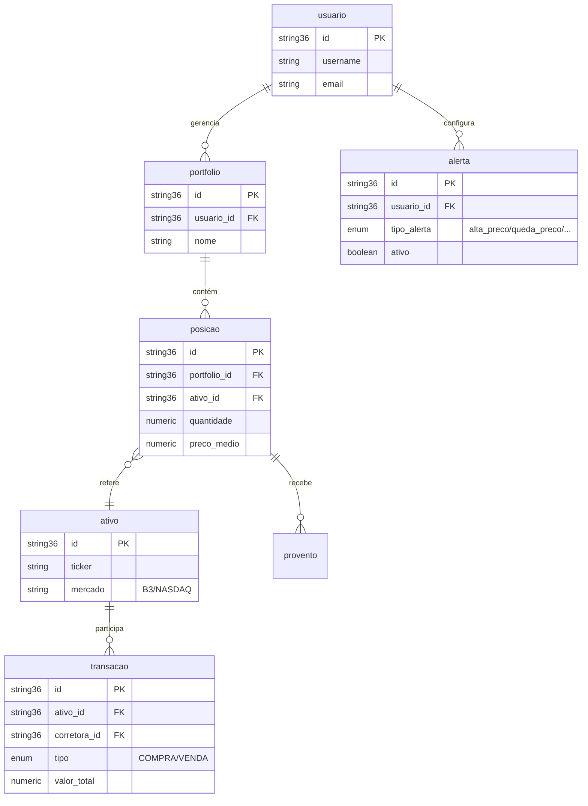
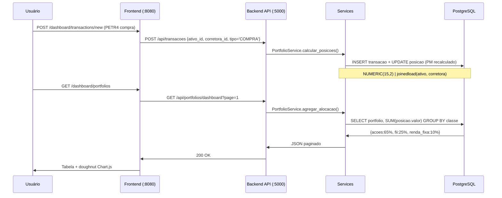
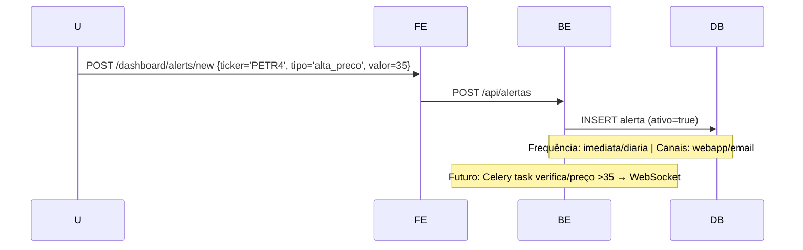
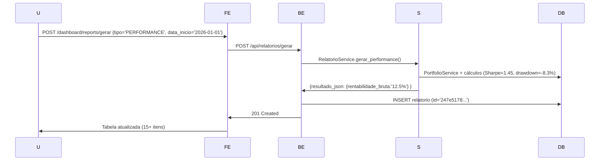

# 🏗️ Arquitetura Exitus v0.7.5 (M7 Complete)

**Data**: 05/Jan/2026 | **Branch**: `feature/docs-reestruturacao` | **Commit**: `d1bbfd9d`

## Stack Técnico

| Camada | Tecnologias Principais | Portas |
|--------|------------------------|--------|
| **Frontend** | Flask/Jinja2 + Tailwind CSS 3.4 + HTMX 1.9 + Alpine.js + Chart.js 4.4 | `:8080` |
| **Backend API** | Flask 3.x + SQLAlchemy 2.x + Marshmallow + JWT (PyJWT) + Alembic | `:5000` |
| **Banco** | PostgreSQL 15 + Índices (86) + FKs (15) + NUMERIC(15,2) moedas | `:5432` |
| **Infra** | Podman (3 containers) + Gunicorn 4 workers + Volumes persistentes | `exitus-net` |

**Containers ativos**:
```
exitus-db         postgres:15     Up 4+ days
exitus-backend    gunicorn        Up 2+ hours  0.0.0.0:5000->5000/tcp
exitus-frontend   gunicorn        Up 1+ hour   0.0.0.0:8080->8080/tcp
```

## Modelo de Dados (Entidades Centrais)



**Total**: 12+ entidades, 86 índices, 15 FKs, migrations Alembic completas.

## Camadas Backend (MVC Padrão Exitus)

```
REQUEST → Blueprint → Service → Model/DB → JSON Response
```

1. **Models** (`backend/app/models/`): SQLAlchemy declarativo, `tablename` explícito singular.
2. **Services** (`backend/app/services/`): Lógica de negócio (PortfolioService 8 métodos, AlertaService).
3. **Blueprints** (`backend/app/blueprints/`): 16+ registrados em `init.py` (portfolio, alertas, transacoes, relatorios).
4. **Schemas** (`backend/app/schemas/`): Marshmallow (snake_case enums, `joinedload` anti-N+1 queries).

## Fluxos Principais

### 1. Transação → Portfolio (M3/M4)



### 2. Alertas (M7.3)



### 3. Relatórios (M7.4)



## Módulos e Status (M0–M7.5)

| Módulo | Escopo Principal | Status | Endpoints Chave | Arquivos Principais |
|--------|------------------|--------|-----------------|---------------------|
| **M0** | Infra Podman/DB | ✅ | Health checks | `podman-compose.yml` |
| **M1** | Auth + CRUD base | ✅ | `/api/auth/login` | `auth_blueprint.py` |
| **M2** | API REST Core | ✅ | `/api/usuarios`, `/api/corretoras` | `usuario_model.py` |
| **M3** | Portfolio Analytics | ✅ | `/api/portfolios/dashboard` | `portfolio_service.py` |
| **M4** | Buy Signals + Fiscais | ✅ | `/api/buy-signals/buy-score/PETR4` | `buy_signals_blueprint.py` |
| **M5** | Frontend Base | ✅ | `/dashboard`, `/auth/*` | `base.html`, `dashboard.py` |
| **M6** | Dashboards (4 telas) | ✅ | `/dashboard/transactions` | `transactions.html` |
| **M7.3** | Alertas CRUD | ✅ | `/api/alertas`, `/dashboard/alerts` | `alerta_model.py` |
| **M7.4** | Relatórios | ✅ | `/api/relatorios/gerar` | `relatorios_blueprint.py` |
| **M7.5** | Cotações Live | ✅ | `/api/cotacoes/PETR4` | `cotacoes_service.py` |

## Decisões de Design Críticas

- **Moeda/DB**: `NUMERIC(15,2)` em vez de float (precisão fiscal BR/US).
- **Enums**: `snake_case` consistente após correções M4 (ex: `alta_preco`).
- **Performance**: `joinedload` em queries com relacionamentos (anti-N+1).
- **Fallback**: Frontend mock data se backend offline (não quebra UI).
- **Deploy**: Gunicorn `--workers 4 --preload`, healthchecks 30s, volumes `exitus-db-data`.
- **Serialização**: Marshmallow schemas explícitos, `unknown=EXCLUDE`.

## Pendências Arquiteturais (M8+)

- **Célery + Redis**: Verificação periódica alertas, background relatórios.
- **WebSocket**: Notificações real-time (Socket.IO).
- **Export PDF/Excel**: ReportLab/Pandas para `/api/relatorios/{id}/export`.
- **Cache**: Redis para cotações (TTL 15min, fallback DB).

---
**Geração**: Perplexity AI | **Base**: commit `d1bbfd9d` + histórico M0-M7 | **Próximo**: USER_GUIDE.md
